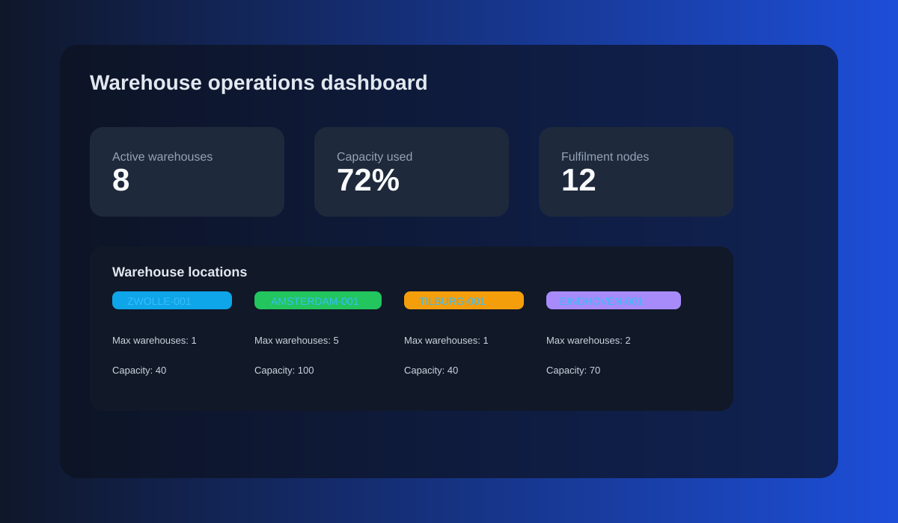
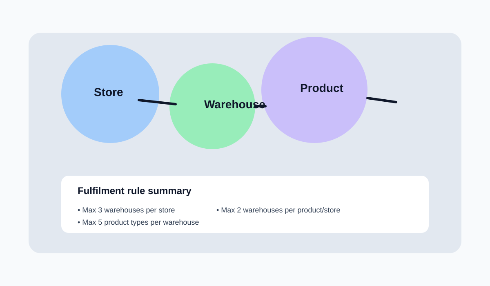
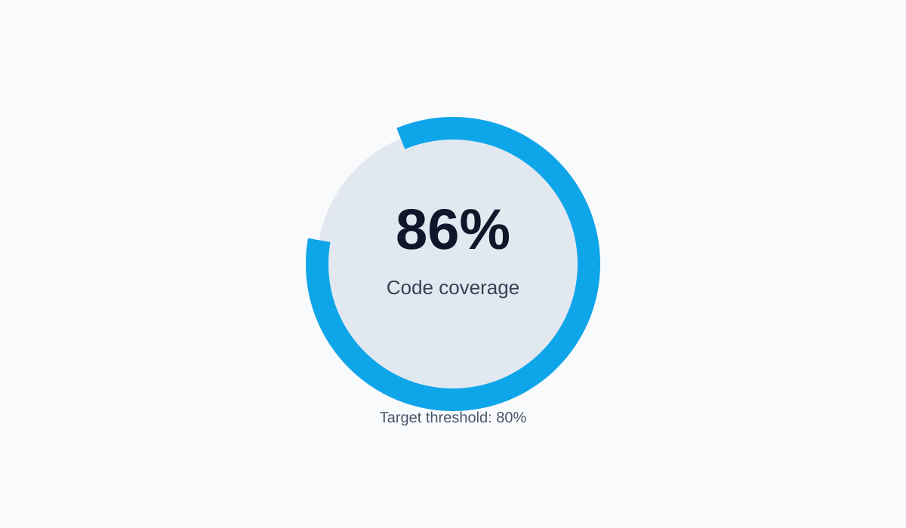

# Fulfilment Warehouse Assignment

This project is a Quarkus-based fulfilment and warehouse management application. It focuses on warehouse validation, inventory constraints, store fulfilment rules, and API-driven integration flows.

## Overview

The application models the following domain capabilities:

- Warehouse lifecycle management: create, replace, archive
- Location validation and capacity checks
- Store and product fulfilment assignment rules
- Legacy downstream sync after database commit
- Automated verification with Maven and JaCoCo coverage gates

## Project structure

- `src/main/java/com/fulfilment/application/monolith/warehouses` – warehouse domain, validation, and adapters
- `src/main/java/com/fulfilment/application/monolith/stores` – store endpoints and legacy gateway integration
- `src/main/java/com/fulfilment/application/monolith/products` – product REST endpoints
- `src/main/java/com/fulfilment/application/monolith/fulfillment` – fulfilment assignment logic and validation
- `src/main/resources` – Quarkus application config and OpenAPI spec
- `src/test/java` – unit and endpoint tests

## Prerequisites

- JDK 17+
- Maven or the included Maven wrapper

## Quick start

```bash
./mvnw clean install
```

To run the application in dev mode:

```bash
./mvnw quarkus:dev
```

Then open:

- http://localhost:8081
- or the relevant endpoint path for the APIs used in the exercise

## Validation and business rules

The application validates:

- unique business unit codes
- valid warehouse locations
- maximum warehouse count per location
- capacity constraints per location
- replacement stock/capacity matching
- fulfilment limits per store and product

The validation logic has been split out into dedicated validator components so that business-rule checks stay separate from the persistence and API layers.

## Screenshots

### Warehouse dashboard



### Fulfilment map



### Coverage dashboard



## Coverage report

Coverage is generated during the Verify phase and published to:

- `target/site/jacoco/index.html`

The build enforces a minimum line coverage threshold of 80%.

## CI pipeline

A GitHub Actions workflow is configured at:

- `.github/workflows/ci.yml`

It runs the following on push and pull requests:

- Java 17 setup
- Maven dependency cache
- `./mvnw clean verify`

## Assignment notes

Details for the domain tasks are documented in:

- [CODE_ASSIGNMENT.md](CODE_ASSIGNMENT.md)
- [QUESTIONS.md](QUESTIONS.md)

## Troubleshooting

If an IDE does not recognize generated sources, mark the generated output directory as a source root or rebuild the Maven project.
